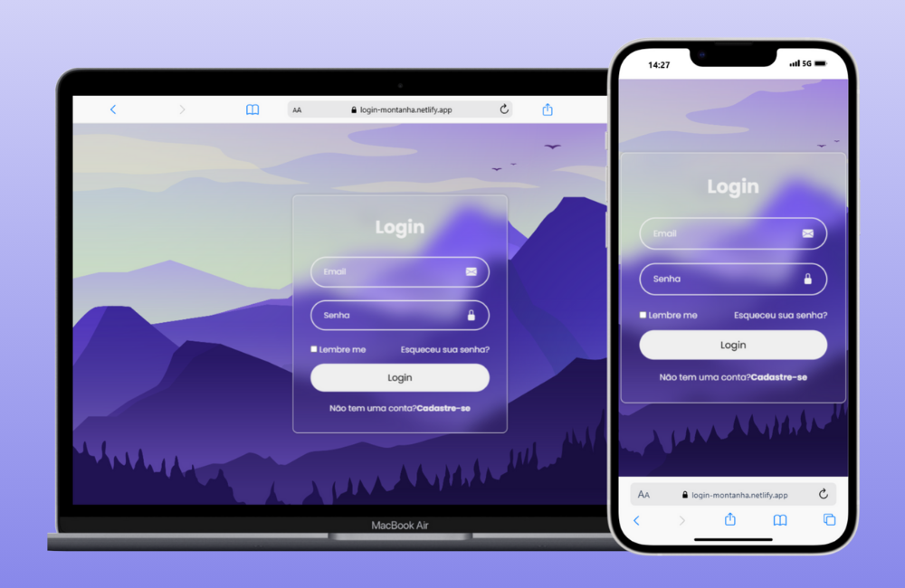

<h1>Login Form</h1>

<b><a style="font-size: 1.5rem" href="https://login-montanha.netlify.app/" target="_blank">Ver Projeto</a></b>

<h3>Login Form</h3>
<ul>
<li>Login Form com HTML e CSS</li>
<li>Com uma linda imagem de uma montanha</li>
<li>Efeito de Vidro no Formulario</li>
<li>Um site adaptado a vária telas e muito legal de se fazer</li>
</ul>

